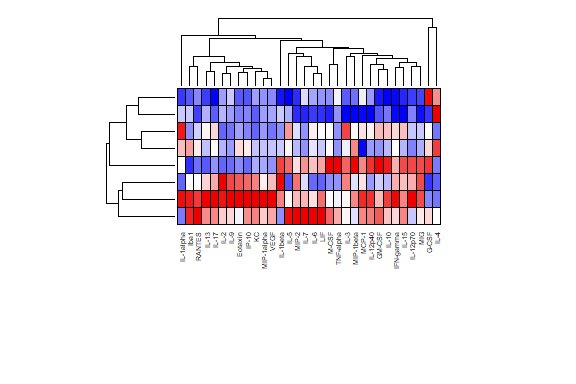
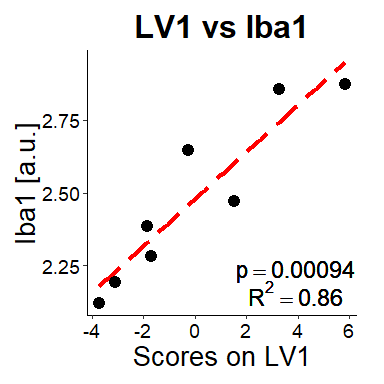

# WoodLabFunctions by afpybus

A repository of commonly used functions by the grad students, lab techs,
and undergrads of the Wood Lab.

## Installation

Copy and paste the following code into your R console:

``` r
# Install
if(!require(devtools)) install.packages("devtools")
devtools::install_github("afpybus/WoodLabFunctions")
```

## Multivariate Analysis

The Wood Lab routinely conducts multivariate analysis in R, including
principal component analysis (PCA), partial least squares regression
analysis (PLSR), and partial least squares discriminant analysis
(PLS-DA). We refer the reader to *Multi- and Megavariate Data Analysis
Basic Principles and Applications* by L. Eriksson for an in-depth
discussion of each.

Load a sample data set from our first repetitive mild traumatic brain
injury (rmTBI) study:

``` r
library("WoodLabFunctions")
#> Loading required package: ggplot2
data(rmTBI)

# Display the first 6 rows and 8 columns
head(rmTBI[,1:8],6)
#>       Iba1 G-CSF Eotaxin GM-CSF IFN-gamma IL-1alpha IL-1beta   IL-2
#> 1 2.873293  4.25    38.5    7.5        12      40.0     13.5 1329.5
#> 2 2.855156  8.25    24.5    9.0         7      23.0      9.5 1132.5
#> 3 2.644766  8.25    26.5    4.5         6      32.0     10.5  999.5
#> 4 2.472525  2.25    32.0    5.5         8      22.0     15.5 1368.0
#> 5 2.383690  2.25    19.5    3.5         0      26.5     10.5 1000.5
#> 6 2.281894  7.25    21.0    7.5         7      39.5      9.5  920.0
```

This data set is derived from eight mice (8 rows) that received three
rmTBI. We measured 32 different proteins (32 columns) after injury and
were interested in whether one of the proteins, Iba1 (a microglial
activation marker), correlated with the rest of the measured proteins.
The other 31 proteins are cytokines, immune signaling proteins. Let’s
take our first look at the data by creating a heatmap:

``` r
hm = heatmap_wl(rmTBI,
                mar=c(10,2),  # set margins to re-size the heatmap
                clust_r = TRUE, # cluster rows by euclidean distance
                clust_c = TRUE, # cluster cols by euclidean distance
                labRow=NA, # remove row labels
                cex_c=0.5) # re-size col labels to fit all of them
```



### Principal Component Analysis (PCA)

Partial least squares regression using Iba1 as a predictor variable and
the cytokines as response variables is an appropriate method for
exploring possible relationships. We will use the ropls package to first
visualize variance in the data using a PCA then to regress the data
against Iba1 using PLSR.

``` r
predictor = rmTBI$Iba1
cytokines = rmTBI[,-1]

# Run the PCA
PCA = ropls::opls(cytokines,predI=2) # set predI=2 to extract just the first two components
#> PCA
#> 8 samples x 31 variables
#> standard scaling of predictors
#>       R2X(cum) pre ort
#> Total     0.75   2   0
```


Next, use rotate_opls() to create output that’s compatible for
scores_plot() and loadings_chart().

``` r
PCA_rot = rotate_opls(PCA)
scores_plot(T1=PCA_rot$T1,T2=PCA_rot$T2,color = rownames(cytokines))
```


Let’s now color the data points by their Iba1 value to get a sense for
the distribution. We can additionally specify that the analysis was a
PCA to update the axis labels.

``` r
# Use scores_plot_gradient instead of scores_plot
scores_plot_gradient(T1=PCA_rot$T1,T2=PCA_rot$T2, 
                     color = predictor, # Set the colors to the Iba1 values stored in predictor
                     analysis = "PCA") # Updates plot title and changes axis labels to "PC1" and "PC2"
```


### Partial Least Squares Regression (PLSR)

Next, we’ll conduct PLSR to create latent variables associated with
changes in Iba1. We’ll use opls() again:

``` r
predictor = rmTBI$Iba1
cytokines = rmTBI[,-1]

# Run the PLSR
PLSR = ropls::opls(cytokines,
                   y=predictor, # set a y variable to change from PCA to PLS
                   predI=2) # set predI=2 to extract just the first two components
#> PLS
#> 8 samples x 31 variables and 1 response
#> standard scaling of predictors and response(s)
#>       R2X(cum) R2Y(cum) Q2(cum) RMSEE pre ort pR2Y pQ2
#> Total    0.705    0.889   0.628 0.114   2   0  0.5 0.2
```


``` r
PLSR_rot = rotate_opls(PLSR)
scores_plot_gradient(T1=PLSR_rot$T1,T2=PLSR_rot$T2, 
                     color = predictor, # Set the colors to the Iba1 values stored in predictor
                     color.str = "Iba1",
                     analysis = "PLS") # Updates plot title and changes axis labels to "PC1" and "PC2"
```


Let’s maximize variance across Iba1 in LV1 by conducting a small
rotation of the model.

``` r
PLSR_rot30 = rotate_opls(PLSR,degrees=30)
scores_plot_gradient(T1=PLSR_rot30$T1,T2=PLSR_rot30$T2, 
                     color = predictor, # Set the colors to the Iba1 values stored in predictor
                     color.str = "Iba1",
                     analysis = "PLS") # Updates plot title and changes axis labels to "PC1" and "PC2"
```


Now that we’ve roughly aligned our greatest variance in Iba1 with LV1,
let’s figure out what drives LV1. We will construct a loadings chart
which will indicate the contribution of each cytokine to the sample
scores along LV1. Highly positive “loadings” indicate correlation with
Iba1 (positive LV1 scores), while negative loadings are associated with
negative LV1 scores.

``` r
loadings_chart(loadings=PLSR_rot30$P1, 
               component_str = "LV1")
```


    #>       [,1]
    #>  [1,]  0.7
    #>  [2,]  1.9
    #>  [3,]  3.1
    #>  [4,]  4.3
    #>  [5,]  5.5
    #>  [6,]  6.7
    #>  [7,]  7.9
    #>  [8,]  9.1
    #>  [9,] 10.3
    #> [10,] 11.5
    #> [11,] 12.7
    #> [12,] 13.9
    #> [13,] 15.1
    #> [14,] 16.3
    #> [15,] 17.5
    #> [16,] 18.7
    #> [17,] 19.9
    #> [18,] 21.1
    #> [19,] 22.3
    #> [20,] 23.5
    #> [21,] 24.7
    #> [22,] 25.9
    #> [23,] 27.1
    #> [24,] 28.3
    #> [25,] 29.5
    #> [26,] 30.7
    #> [27,] 31.9
    #> [28,] 33.1
    #> [29,] 34.3
    #> [30,] 35.5
    #> [31,] 36.7

### PLSR with Leave One Out Cross Validation

To ensure the results of the model are not heavily dependent on any one
sample, we will conduct a leave one out cross validation with 25
iterations. We’ll then add error bars depicting the standard deviation
across all iterations.

``` r
PLSR_LOOCV = opls_LOOCV(cytokines,
                   y=predictor, 
                   runs=25) # sets number of iterations
#> PLS
#> 8 samples x 31 variables and 1 response
#> standard scaling of predictors and response(s)
#>       R2X(cum) R2Y(cum) Q2(cum) RMSEE pre ort pR2Y pQ2
#> Total    0.705    0.889   0.628 0.114   2   0 0.25 0.1
```


``` r
PLSR_LOOCV_rot30 = rotate_opls_LOOCV(PLSR_LOOCV,degrees=30)
loadings_chart_sd(loadings=PLSR_LOOCV_rot30$P1, 
                  sd = PLSR_LOOCV_rot30$sd_P1_LOOCV,
                  component_str = "LV1",
                  lim = 1.2) # set a higher axis limit to see full error bars
```


    #>       [,1]
    #>  [1,]  0.7
    #>  [2,]  1.9
    #>  [3,]  3.1
    #>  [4,]  4.3
    #>  [5,]  5.5
    #>  [6,]  6.7
    #>  [7,]  7.9
    #>  [8,]  9.1
    #>  [9,] 10.3
    #> [10,] 11.5
    #> [11,] 12.7
    #> [12,] 13.9
    #> [13,] 15.1
    #> [14,] 16.3
    #> [15,] 17.5
    #> [16,] 18.7
    #> [17,] 19.9
    #> [18,] 21.1
    #> [19,] 22.3
    #> [20,] 23.5
    #> [21,] 24.7
    #> [22,] 25.9
    #> [23,] 27.1
    #> [24,] 28.3
    #> [25,] 29.5
    #> [26,] 30.7
    #> [27,] 31.9
    #> [28,] 33.1
    #> [29,] 34.3
    #> [30,] 35.5
    #> [31,] 36.7

Finally, we can assess the performance of the PLSR by computing a
regression of Iba1 with scores on LV1. We can show this graphically
using scatter_reg():

``` r
scatter_reg(x=PLSR_LOOCV_rot30$T1,y=predictor,
            xlab = "Scores on LV1",
            ylab = "Iba1 [a.u.]",
            title = "LV1 vs Iba1")
```



## Linear Range Analysis

Assessing the linear range of detection for multiplex ELISA kits is a
key quality control step that must be completed before sample
measurement. In short, the user selects a single sample and loads
increasing amounts of lysate into multiple assay wells. After completion
of the ELISA, the expected result is that increased total protein
loading correlates with increased detection of each protein. For
proteins that do not show this linear increase in detection with
increases in loading, they are considered to be outside of the
detectable linear range for the chosen loadings.

Let’s load some example linear range data to explore. The first column
contains values for mass of total protein \[ug\] and each subsequent
column contains detected fluorescent values \[a.u.\] of a
phospho-protein from our MAPK Luminex assay.

``` r
data(LinearRange)

LinearRange
#> # A tibble: 8 x 10
#>    Mass pAtf2 pMek1  pJnk `p-p90 RSK` `p-p38` `pErk1/2` pHSP27 pStat3 `p-p53`
#>   <dbl> <dbl> <dbl> <dbl>       <dbl>   <dbl>     <dbl>  <dbl>  <dbl>   <dbl>
#> 1   0      43  13.5     7           9    18        14       15   12      12  
#> 2   0.5    64  28       8          14    18.5      15       21   17      11  
#> 3   1      74  53       9          12    19        15       21   17      12  
#> 4   1.5    87  58.5    10          13    17.5      15       23   16.5    13  
#> 5   2      88  57      10          13    17        16       21   20      12  
#> 6   3     132  75      11          14    19        15.5     24   20      13  
#> 7   4     134  68      11          13    18        17       28   21      13  
#> 8   6     155  70      11          16    18        19       26   23      12.5
```

First, let’s construct an x-y scatter graph for a single measured
phospho-protein to see the relationship between detected analyte and
loaded total protein using scatter_reg():

``` r
scatter_reg(x=LinearRange$Mass,y=LinearRange$pJnk,
            xlab="Protein Mass [ug]",ylab="pJnk [a.u.]",
            showRSQ=FALSE,showP=FALSE,
            method="loess")
```


The most important outcome from your linear range will be the amount of
protein to load in your subsequent assays. You will want to look at the
linear range of ALL measured proteins and select the loading which is
appropriate for the highest number of proteins of interest. We can do
this easily using LinearRangePanel().

``` r
loadings = LinearRange$Mass
analytes = LinearRange[,2:10]

panel = LinearRangePanel(analytes = analytes,loadings = loadings,xlab = "Protein Mass [ug]")
```


We selected a loading of 1ug, which we can display on the graphs to help
assess its suitability:

``` r
loadings = LinearRange$Mass
analytes = LinearRange[,2:10]

panel = LinearRangePanel(analytes = analytes,loadings = loadings,xlab = "Protein Mass [ug]",xintercept = 1)
```


In this example, we would have high confidence in measured values for
pAtf2, pMek1, pJnk, pErk1/2, pHSP27, and pStat3. p-p38 is outside of its
detectable linear range.
